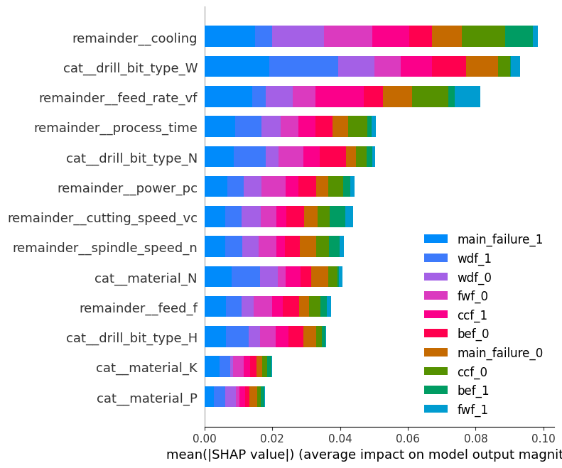
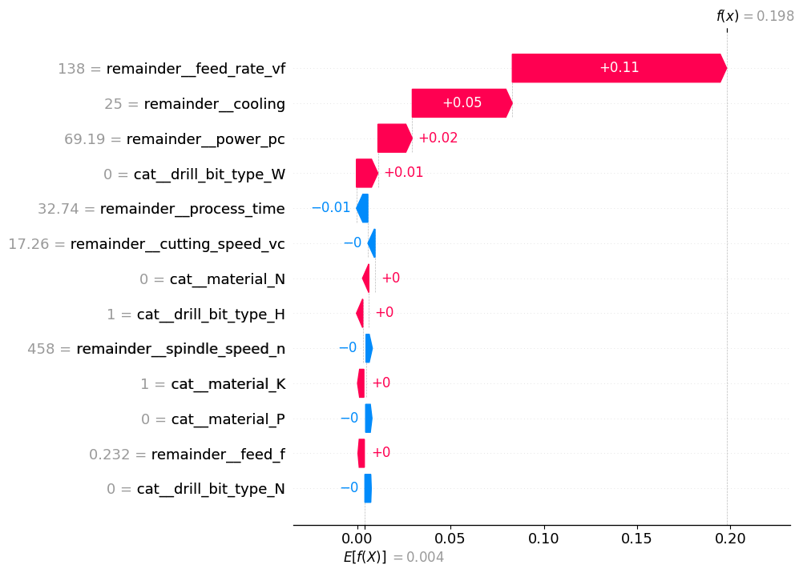

# Explainable AI drilling: Predicting the failure and their categories

#### OpenAPI

[View docs here](https://xai-drilling-prediction-17.onrender.com/docs)

#### UI app

[Try ui app here](https://xai-drilling-prediction-deploy-ui-963074352354.europe-west2.run.app/app)

## Introduction

This synthetic dataset simulates the drilling process and the failures modes associated with it. There are 20,000 records with 10 features associated with each datapoints. It records the parameters of the drilling procees and whether the process resulted in failure and the category of failure that occured.

### Dataset fields

- **ID**: identify each iteration so it can be traced back and references, useful for analysing drilling scenarios and anomalies.

- **Cutting speed vc (m/min)**: An important parameter that affect quality and efficiency of drilling process. It captures the speed at which the drill bit's cutting edge moves through the material.

- **Spindle speed n (1/min)**: Rotational speed of spindle or the drill bit.

- **Feed rate vf (mm/min)**: It measures how quickly the material is fed to the drill bit. It is a determinant of the overall drilling time and influences the heat generated during the process.

- **Power Pc (kW)**: The power consumption during drilling can be indicative of the efficiency of the process and the wear state of the drill bit.

- **Cooling (%)**: Effective cooling is paramount in drilling, preventing overheating and reducing wear. 4 level of cooling level  can be applied:  no cooling (0%), partial cooling (25% and 50%), and high to full cooling (75% and 100%).

- **Material**: The type of material being drilled can significantly influence the drilling parameters and outcomes. This dataset encompasses three primary materials: C45K hot-rolled heat-treatable steel (EN 1.0503), cast iron GJL (EN GJL-250), and aluminum-silicon (AlSi) alloy (EN AC-42000), each presenting its unique challenges and considerations. The three materials are represented as “P (Steel)” for C45K, “K (Cast Iron)” for cast iron GJL and “N (Non-ferrous metal)” for AlSi alloy.

- **Drill Bit Type**: Different materials often require specialized drill bits. This feature categorizes the type of drill bit used, ensuring compatibility with the material and optimizing the drilling process. It consists of three categories, which are based on the DIN 1836: “N” for C45K, “H” for cast iron and “W” for AlSi alloy.

- **Process time t (s)**: Full duration of each drilling operation, providing insights into efficiency and potential bottlenecks.

- **Main failure**: This is a binary feature that indicates if any significant failure on the drill bit occurred during the drilling process. A value of 1 flags a drilling process that encountered issues, which in this case is true when any of the subgroup failure modes are 1, while 0 indicates a successful drilling operation without any major failures.

In case a main failure occurs ie flag value is 1, there is a subcategory of failures which record what kind of failure occured. Multiple catergories can occur at once for each process.

- **Build-up edge failure (215x)**: Represented as a binary feature, a build-up edge failure indicates the occurrence of material accumulation on the cutting edge of the drill bit due to a combination of low cutting speeds and insufficient cooling. A value of 1 signifies the presence of this failure mode, while 0 denotes its absence.

- **Compression chips failure (344x)**: This binary feature captures the formation of compressed chips during drilling, resulting from the factors high feed rate, inadequate cooling and using an incompatible drill bit. A value of 1 indicates the occurrence of at least two of the three factors above, while 0 suggests a smooth drilling operation without compression chips.

- **Flank wear failure (278x)**: A binary feature representing the wear of the drill bit's flank due to a combination of high feed rates and low cutting speeds. A value of 1 indicates significant flank wear, affecting the drilling operation's accuracy and efficiency, while 0 denotes a wear-free operation.

- **Wrong drill bit failure (300x)**: As a binary feature, it indicates the use of an inappropriate drill bit for the material being drilled. A value of 1 signifies a mismatch, leading to potential drilling issues, while 0 indicates the correct drill bit usage.

## Model

This is identified as a classification problem since we are to determine whether a failure occured and if so what category this failure belongs to.

#### Algorithm

[Random forest classifier ](https://scikit-learn.org/stable/modules/generated/sklearn.ensemble.RandomForestClassifier.html)is chosen which predicts a or set of labels from the from the features. 

#### Feature engineering

This is an intergral part of machine leaning so the model can correctly *learn*

##### Inputs

The *material* and *drill_bit_type* are categorical value which is encoded using [OneHotEncoder.](https://scikit-learn.org/stable/modules/generated/sklearn.preprocessing.OneHotEncoder.html) The features fed to the model are *material, drill_bit_type,cutting_speed_vc, spindle_speed_n, feed_f, feed_rate_vf, power_pc, cooling, process_time* 

##### Outputs

*main_failure* is binary flag which indicates if any type of failure occured while *bef,cef,fwf,* and *wdf* denote what kind of failure occured. 

So a new category called *failure_cat* is created by combining *bef,cef,fwf,* and *wdf* so  multiple failure conditions can be predicted by single model.

*faliure_cat* is encoded by [LabelEncoder](https://scikit-learn.org/stable/modules/generated/sklearn.preprocessing.LabelEncoder.html) which map n result categories into *n-1*  classes.

The table of output after label encoding

| failure        | failure_cat(output_label) |
| -------------- | ------------------------- |
| main_failure_0 | 0                         |
| main_failure_1 | 1                         |
| bef_0          | 2                         |
| bef_1          | 3                         |
| ccf_0          | 4                         |
| ccf_1          | 5                         |
| fwf_0          | 6                         |
| fwf_1          | 7                         |
| ccf_0          | 8                         |
| ccf_1          | 9                         |

##### Pipeline

A pipeline preprocesses the data so it can be used by the model

First pipeline stage encoded the categorical columns drill_bit_type and the material using [OneHotEncoder](https://scikit-learn.org/stable/modules/generated/sklearn.preprocessing.OneHotEncoder.html). The rest of the fields is pass through. The estimator the pipeline is [Random forest classifier](https://scikit-learn.org/stable/modules/generated/sklearn.ensemble.RandomForestClassifier.html)

<!-- [Click here to view detailed Pipeline setup](./fig.html) -->

## Analysis

###### SHAP influence of each feature on the failure category

> The conclusions are
> 
> - The *cooling* has the highest influence to determine which class of failure a drill process belongs to.
> 
> - Whether the *material P* is used has the least influence
> 
> - Broadly speaking, **cooling, type of drill bit,feed rate and process time** determines the outcomes
> 
> - The **material used** has least influence the success of the process

###### Analysing a single row

This is  a a sample row with ID *11295* after encoder have been applied

| feature                       | value |
| ----------------------------- | ----- |
| *cat__material_K*             | 1     |
| *cat__material_N*             | 0     |
| *cat__material_P*             | 0     |
| *cat__drill_bit_type_H*       | 1     |
| *cat__drill_bit_type_N*       | 0     |
| *cat__drill_bit_type_W*       | 0     |
| *remainder__cutting_speed_vc* | 17.26 |
| *remainder__spindle_speed_n*  | 458   |
| *remainder__feed_f*           | 0.232 |
| *remainder__feed_rate_vf*     | 138   |
| *remainder__power_pc*         | 69.19 |
| *remainder__cooling*          | 25    |
| *remainder__process_time*     | 32.74 |

 The output  which stands for ccf failure.

| label          | value |
| -------------- | ----- |
| *main_failure* | 1     |
| *bef*          | 0     |
| *ccf*          | 1     |
| *fwf*          | 0     |
| *wdf*          | 0     |

A ccf failure has occurred

The sample SHAP waterfall figure for true value of ccf was caluclated is a s follows
 

> Analysing this particular instant where the drilling process failed, *feed_rate* had the highest effect along with *cooling*. So insufficient cooling along with wrong feed rate must have caused this failure

## References

#### Dataset credit

Kaggle link

https://www.kaggle.com/datasets/raphaelwallsberger/xai-drilling-dataset?resource=d

> This dataset is part of the following publication at the TransAI 2023 conference:
> R. Wallsberger, R. Knauer, S. Matzka; "Explainable Artificial Intelligence in Mechanical Engineering: A Synthetic Dataset for Comprehensive Failure Mode Analysis"
> DOI: http://dx.doi.org/10.1109/TransAI60598.2023.00032

#### License

[CC BY-NC-SA 4.0](https://creativecommons.org/licenses/by-nc-sa/4.0/)
